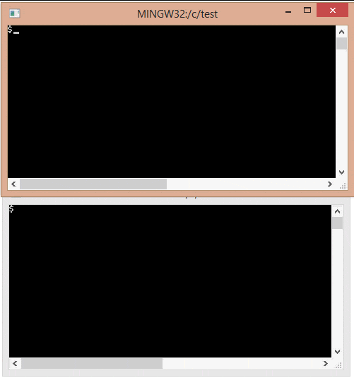

[](https://travis-ci.org/codeplea/fsghost)

# FsGhost - Cross-Platform File Change Monitoring in C


FsGhost is a *tiny* command-line tool to monitor and notify of file changes in a
given directory. FsGhost works natively on both Windows and Linux and is
self-contained in only 1 C file. Its only dependencies are the operating system
headers for your platform.

## Features

- **ANSI C with no external dependencies**.
- Contained in a single source file.
- Simple.
- Released under the zlib license - free for nearly any use.


## Example Usage

Call `fsghost` with a single argument, the path of the directory you'd like to monitor.

```
mkdir test-dir
fsghost test-dir
```

FsGhost will then monitor that directory. If any files are created, written, or
deleted, FsGhost will write that filename to the standard output.




## Building
You can probably build by simply running `make`. If that doesn't work, try to compile
`main.c`. It should be pretty easy.

## FAQ
### Does FsGhost do polling.
No. FsGhost uses the proper file-system APIs on each platform to get notified when changes take place. This means
that it uses very few system resources when running, and will not bog down your machine. It's made to be run in the background
for long periods of time.

For Windows, FsGhost uses the `ReadDirectoryChangesW` API. For Linux, it uses the `inotify` API.
